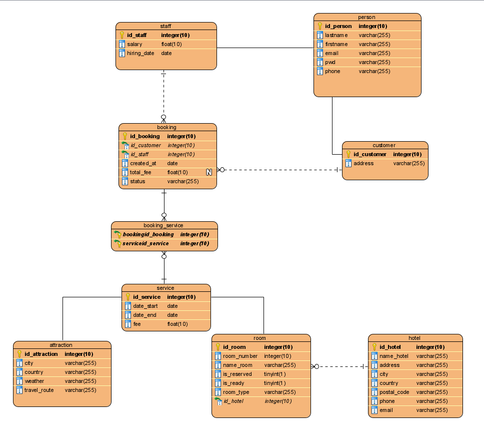

# bdd_agence_voyage 

Nom du projet : Agence de voyage

SGBD : MySQL

Contexte : Cours de base de données avancée 

Documentation : https://docs.google.com/document/d/1ghTqJm3oYeZadJsgrBbenogH35kyLundEaOs4jKWNl8/edit?usp=sharing

Participant au projet : Hugo CARRASCO, Seohyun PARK, Yanjie SHI, Zerui Wang, Zuanli CAI
